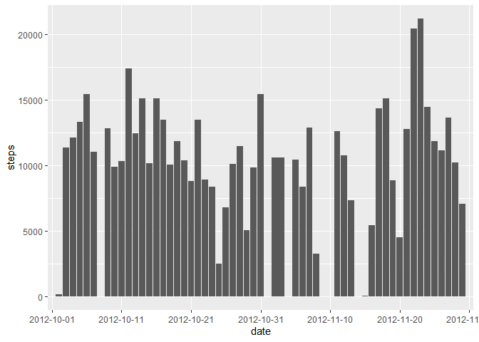
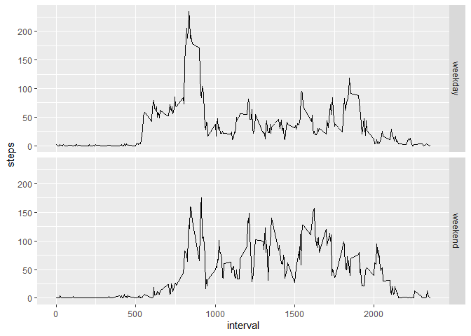

## Loading and preprocessing the data

The following code downloads the data (if necessary) to the correct directory and unzips the file. The data is then read in via the *read.csv* function.


```r
directory <-"C:\\Users\\RYZEN\\Documents\\R\\Reproducible Research\\Week 2 Project"
setwd(directory)
url <- "https://d396qusza40orc.cloudfront.net/repdata%2Fdata%2Factivity.zip"

if(!file.exists(paste(directory,"\\",basename(url),sep="")))
{
  temp <- download.file(url,file.path(directory,basename(url)))
  unzip(zipfile = basename(url), exdir = directory)
}

rawData <- read.csv(paste(directory,"\\activity.csv",sep=""))
```

## What is mean total number of steps taken per day?

The following code calculates the total number of steps taken per day and displays the first six rows of that data.


```r
stepsPerDay<-aggregate(steps~date,data=rawData,sum,na.rm = TRUE)
head(stepsPerDay)
```

```
##         date steps
## 1 2012-10-02   126
## 2 2012-10-03 11352
## 3 2012-10-04 12116
## 4 2012-10-05 13294
## 5 2012-10-06 15420
## 6 2012-10-07 11015
```

The following code plots a histogram of the total number of steps taken per day.


```r
library(ggplot2)
every_nth = function(n) {
  return(function(x) {x[c(TRUE, rep(FALSE, n - 1))]})
}
ggplot(rawData,aes(x=date,y=steps))+geom_histogram(stat = "identity")+scale_x_discrete(breaks = every_nth(n = 10))
```

<!-- -->

The following code calculates the mean and median of the total number of steps taken per day. 


```r
meanSteps<-format(mean(aggregate(steps~date,data=rawData,sum,na.rm = TRUE)$steps),scientific=FALSE)
medianSteps<-median(aggregate(steps~date,data=rawData,sum,na.rm = TRUE)$steps)
```

The mean steps are 10766.19 and the median steps are 10765. 

## What is the average daily activity pattern?

The following code plots a line graph of the average number of steps taken per 5 minute interval averaged over all days, as well as calculating a maximum step interval as described below. 


```r
stepsInterval<-aggregate(steps~interval,data=rawData,mean,na.rm = TRUE)
with(data=stepsInterval,plot(x=interval,y=steps,type="l"))
```

<!-- -->

```r
maxStepsInterval<-stepsInterval[which.max(stepsInterval$steps),1]
```

The interval, on average across all the days in the dataset, which contains the maximum number of steps is the 835 interval. 

## Imputing missing values


```r
totalNA<-sum(is.na(rawData$steps))
```

The total number of missing step values is 2304.

The following code imputs missing data using the mean for that 5-minute interval. It then plots a histogram of the new imputed data.   


```r
newData<-transform(rawData,
          steps=ifelse(is.na(steps),
                       ave(steps,interval, FUN=function(x) mean(x,na.rm=TRUE)),
                       steps)
          )

ggplot(newData,aes(x=date,y=steps))+geom_histogram(stat = "identity")+scale_x_discrete(breaks = every_nth(n = 10))
```

<!-- -->

```r
meanNew<-format(mean(aggregate(steps~date,data=newData,sum,na.rm = TRUE)$steps),scientific=FALSE)
medianNew<-format(median(aggregate(steps~date,data=newData,sum,na.rm = TRUE)$steps),scientific=FALSE)
```

The new mean and median are 10766.19 and 10766.19 respectively. The mean did not change but the median did change slightly with the imputed data. The total daily number of steps increased with the imputed data (according to the two graphs), but the average values did not change much because averaged data was used for the imputing.     

## Are there differences in activity patterns between weekdays and weekends?

A new variable was created in the dataset with two levels "weekday" and "weekend". A time series plot of the 5 minute intervals vs the average number of steps averaged across all weekday or weekend days is shown below.


```r
factorData<-transform(rawData,
          dayType=factor(ifelse(weekdays(as.Date(date))=="Saturday"|weekdays(as.Date(date))=="Sunday",
                       "weekend",
                       "weekday")))

stepsIntervalNew<-aggregate(steps~interval+dayType,data=factorData,mean,na.rm = TRUE)
ggplot(stepsIntervalNew,aes(x=interval,y=steps))+geom_line()+facet_grid(dayType~.)
```

<!-- -->
